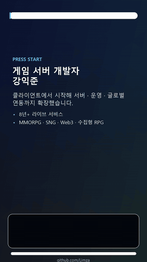

# 👋 강익준 | Game Server Programmer

**다양한 장르와 플랫폼의 라이브 서비스를 경험한 게임 서버 개발자입니다.**

MMORPG · SNG · 수집형 RPG · 블록체인 게임 · 글로벌 라이브 서비스  
서버 구조, 플랫폼 연동, 로그/운영 흐름을 함께 고민합니다.

 

### 🎬 40초 소개 영상

[▶ Shorts로 보기](https://youtube.com/shorts/a7pTPRzSb7E)

---

## 🧭 About Me

기능을 만드는 것에서 끝내지 않고, **운영 중에 문제가 빨리 보이고 다시 고치기 쉬운 구조**를 좋아합니다.

- 🏗️ 게임 서버 아키텍처 설계와 구현
- 🌍 글로벌 로그인, 결제, 플랫폼 연동
- 📡 Redis 기반 캐시, 세션, 로그 파이프라인
- ☁️ AWS/GCP 기반 클라우드 서버 운영
- 🔧 라이브 서비스 안정화와 장애 대응

## 🛠️ Tech Stack

| Area | Tech |
| --- | --- |
| **Languages** | C++, C#, Node.js, TypeScript, Go, Lua, PHP, Solidity |
| **Server / Network** | IOCP, Socket Programming, Netty, ASP.NET, Protobuf |
| **Database / Cache** | MySQL, MongoDB, Redis |
| **Cloud / Infra** | AWS EC2, AWS Lambda, AWS EKS, Amazon ECR, GCP Functions, Linux, Jenkins |
| **Game / Client** | Unity, Cocos2d-x, Cocos Creator, Android, iOS |

## 💼 Experience Timeline

| Period | Company / Project | Role | Main Work |
| --- | --- | --- | --- |
| **2024.07 - 2025.09** | **블랙스톰 / Re:Memento** | Server Programmer | 신규 서버 아키텍처, 글로벌 로그인/IAP, Redis Stream 로그 파이프라인 |
| **2021.10 - 2023.07** | **handy labs / Blockchain Game Service** | Programming Lead | Web3 백엔드, Smart Contract 연동, AWS Lambda/GCP Functions 서버리스 운영 |
| **2020.12 - 2021.10** | **CCR / MMORPG Server** | Server Programmer | AOI, 월드/인스턴스 던전, 충돌 판정, 실시간 동기화 |
| **2018.01 - 2020.11** | **파티게임즈 / I Love Coffee** | Client & Server Programmer | 라이브 안정화, 신규 과금 시스템, 운영 도구, LINE 플랫폼 이슈 대응 |
| **2015.07 - 2017.01** | **모바일앤컴퍼니 / Battle Monster** | Client Programmer | Cocos2d-x 콘텐츠 개발, Facebook 연동, 다국어 로컬라이징, UI/UX 개선 |

## 🚀 Featured Work

### 🌐 Re:Memento — Global Live Service Backend

- C++, C#, .NET, MySQL, MongoDB, Redis, Protobuf, AWS EKS 사용
- 프로젝트 초기 단계부터 서버 아키텍처 설계와 구현 참여
- Hive, Payletter, Epic Store, VNG 등 외부 플랫폼 연동
- Redis Stream 기반 실시간 서버 로그 수집 파이프라인 구축
- 장애 대응 속도를 높이기 위한 로그 수집/분석 흐름 개선

### ⛓️ Blockchain Game Service — Web3 & Serverless

- Node.js, TypeScript, Solidity, AWS Lambda, GCP Functions 사용
- Smart Contract와 게임 서비스 백엔드 연동
- 서버리스 구조 도입으로 오토스케일링 가능한 운영 환경 구성
- PHP, MySQL, Redis 기반 레거시 서비스 안정 운영

### 🗺️ MMORPG Server — AOI & Real-time Sync

- Node.js, MySQL, Redis, Linux 사용
- AOI 기반 관심 영역 처리 구현
- 월드, 인스턴스 던전, 충돌 판정, 동기화 로직 개발
- 대규모 필드 메시지 처리량을 고려한 서버 구조 개선

### ☕ I Love Coffee — Long-running Live Service

- C++, Lua, Cocos2d-x, Java, Unity, MySQL, MongoDB, Redis 사용
- 장기 라이브 서비스 안정화와 신규 콘텐츠 업데이트
- 신규 과금 시스템 설계와 개발
- CS/QA 운영 도구 개발 및 LINE 플랫폼 이슈 대응

### ⚔️ Battle Monster — First Game Project

- C++, Cocos2d-x, Linux, Android, iOS 사용
- Facebook 연동과 다국어 로컬라이징 구현
- Cocos2d-x 기반 신규 콘텐츠 개발 및 UI/UX 개선
- 서버 프로그래머로 전직하기 전, 게임 클라이언트 개발 기반을 쌓은 첫 회사 경험

## 🧠 How I Work

- 먼저 서비스 요구와 운영 흐름을 이해한 뒤 구현합니다.
- 새로운 기술을 도입할 때는 유지보수 비용과 팀의 학습 비용을 함께 봅니다.
- 장애가 났을 때 원인을 빨리 찾을 수 있는 로그와 관측 가능성을 중요하게 생각합니다.
- 추상화보다 읽기 쉬운 코드를 선호하고, 프로젝트에 맞는 단순한 구조를 지향합니다.

## 🎮 Current Interest

최근에는 게임 서버 경험을 바탕으로 **Unity 기반 게임 개발**과 **전투 시스템 설계**에도 관심을 넓히고 있습니다.  
서버, 콘텐츠, 플레이 경험이 서로 어떻게 맞물리는지 계속 실험하고 있습니다.

---

**오래 운영되는 게임은 안정적인 구조, 빠른 대응, 함께 일하기 쉬운 코드에서 시작된다고 믿습니다.**

